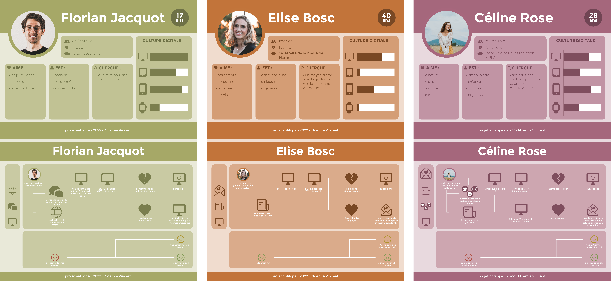
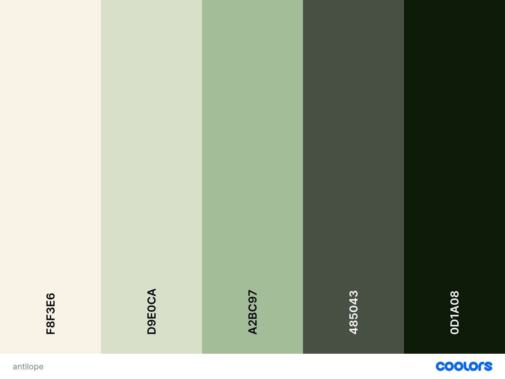
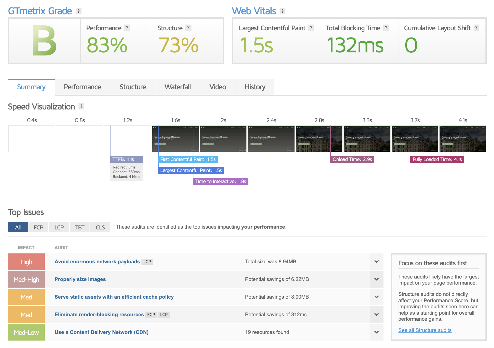
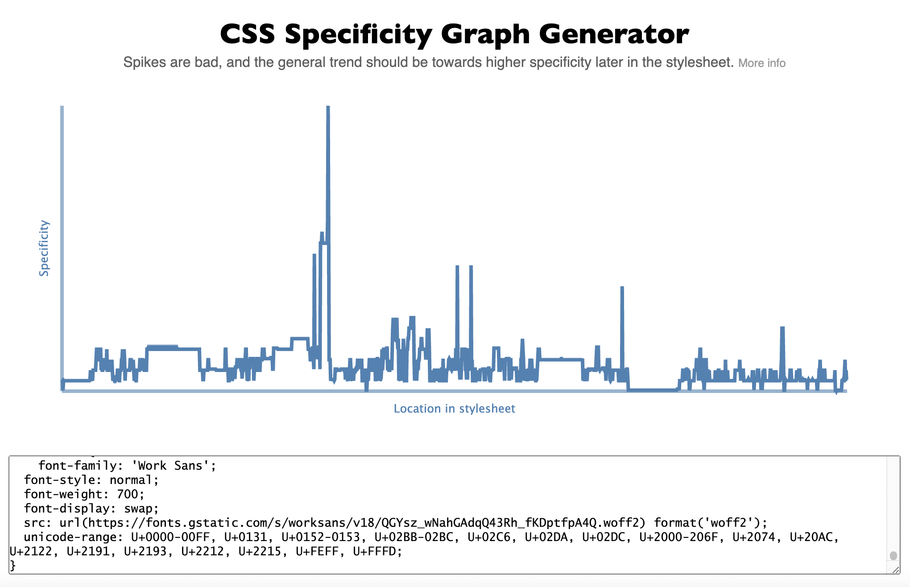
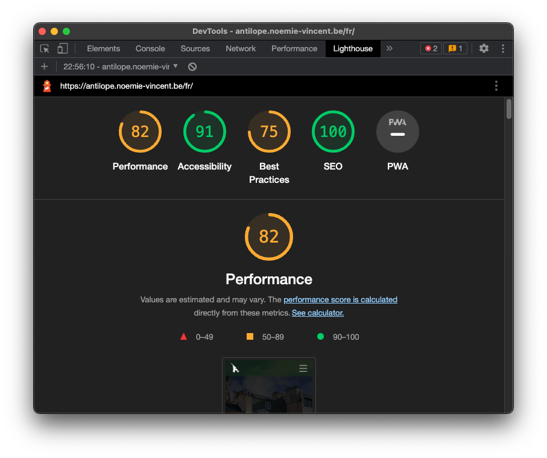

# Projet ANTILOPE

> lien vers le [site](https://antilope.noemie-vincent.be/)

## PUBLIC CIBLE

#### TRANCHE D'ÂGE

- à partir de 18 ans

#### STATUT SOCIOPROFESSIONNEL

- partenaires publiques pour l’installation de certains modules (villes,…).
- domaine de la recherche.
- futurs étudiants chez les ingénieurs et notamment les passerelles Sciences de l’ingénieur industrielle orientation électronique et systèmes embarqués.

#### EXPÉRIENCE DE L'INFORMATIQUE ET D'INTERNET

- peut varier d'une utilisation occasionnelle à quotidienne

#### CONFIGURATION DU MATÉRIEL UTILISÉ

- adapté à tous les supports aussi bien du côté esthétique qu'accessible

------

## PROTOTYPAGE

> voir le [wireframe](https://www.figma.com/file/OTvoSPafjqMoZbjj0xrN3s/Antilope?node-id=0%3A1) et le [design](https://www.figma.com/file/OTvoSPafjqMoZbjj0xrN3s/Antilope?node-id=42%3A2) (figma)

#### OBJECTIFS

- mettre en avant (vitrine) le travail réalisé en matière de développement électronique à destination de la mesure de pollution via la collaboration entre la HEPL – Service électronique & systèmes embarqués et l’ISSep

#### CONTRAINTES

- site disponible en français et en anglais
- site adaptés aux supports mobiles
- utilisation des logos de l’ISSep, du service électronique et de la HEPL
- les couleurs allient l’aspect environnement et technique (en faisant « sérieux »)

#### INFORMATIONS REÇUES

- présentation du contexte de la surveillance de la qualité de l’air et de la participation de la HEPL et notamment du service électronique dedans
- présentation de l’[ISSeP](https://www.issep.be/)
- présentation de la HEPL ([département ingénieur](https://www.ingehepl.be)) et notamment du [service électronique & systèmes embarqués](https://www.ingehepl.be/master-en-sciences-de-lingenieur-industriel-orientation-electronique-systemes-embarques/) de la HEPL

#### PAGES

- accueil
- modules
- module seul
- à propos
- publications
- contact

------

## RECHERCHES

> voir le [moodboard](https://app.milanote.com/1Oiptu1cYJ3Vee?p=253aev7WzKS) (milanote)

### MOTS CLÉS

- ecology
- pollution
- showcase
- air quality

### PALETTE DE COULEURS

------

## TEST D'ACCESSIBILITÉS
#### GTMetrix

#### CSS Specificity graph generator

#### Lighthouse

